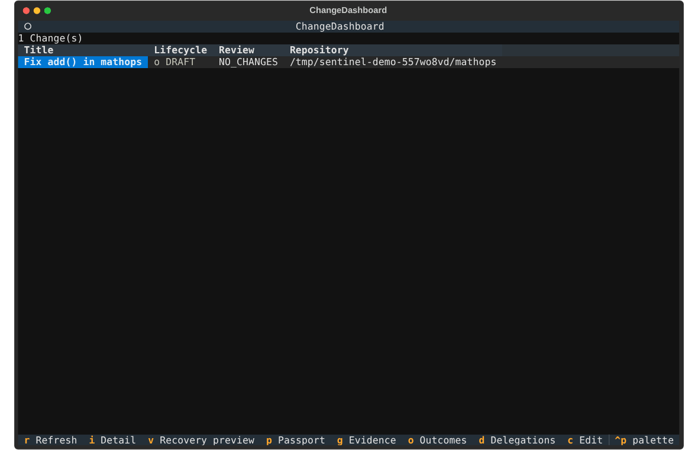

<p align="center">
  
</p>

<h1 align="center">Sentinel</h1>

<h3 align="center">a change assurance runtime for AI coding agents</h3>

## Try the regression lab on Linux

Python 3.12+, Git, and Node (for the Node tasks) are required. The package is
`sentinel-runtime` (Apache License 2.0). Until the first tagged release is on PyPI
(`pipx install sentinel-runtime`), install from the checkout:

```bash
git clone https://github.com/krishbansalofficial/Sentinel.git
cd Sentinel
python3 -m venv .venv
source .venv/bin/activate
pip install -e '.[test,tui,keyring,telemetry]'
sentinel doctor
sentinel eval run --suite evals/tasks --agent mock --task op-add --k 1 \
  --mock-skill 1 --allow-unconfined-hidden-tests --out results/smoke.json --html results/smoke.html
sentinel eval leaderboard results/smoke.json --html results/index.html
```

This smoke test uses a mock agent and explicitly runs hidden tests on the host. A real
Linux agent requires bubblewrap, usable user namespaces and delegated cgroup v2 controllers;
`sentinel doctor` explains missing prerequisites. Ubuntu's AppArmor setup is documented in
[the shipped profile](packaging/apparmor/sentinel-bwrap). Windows uses AppContainer and Job
Objects. Checks run in confined boxes on both platforms; unavailable checks fail closed.

<p align="center">
  
</p>

The terminal UI against a real backend holding three recorded backtest runs (mock agent, so
cost is synthetic; every hidden test ran in the verified Linux sandbox). The Eval screen shows
the same verdict as `sentinel eval compare`. How it was recorded:
[`bench/release/demo`](bench/release/demo/README.md); the runs:
[`bench/regression_detection`](bench/regression_detection/README.md).

| Recorded evaluation | Attempts | Passed | Wilson 95% interval | Boundary |
| --- | ---: | ---: | --- | --- |
| Mock smoke, `op-add`, skill=1 | 1 | 1 | 20.7%–100.0% | UNCONFINED |
| Claude | — | — | Awaiting an authenticated run | — |

The [raw smoke result](bench/observability/mock-smoke.json) validates the pipeline. Mock cost
and tokens are synthetic. It is not a model benchmark. Use `--record` against a running
authenticated backend to view results in the desktop **Eval** page. The leaderboard command
builds a static page from selected result files; compare matching suites and task sets.

Tracing is off by default. With the `telemetry` extra installed, set
`OTEL_EXPORTER_OTLP_ENDPOINT=http://127.0.0.1:4318` in both the backend and eval CLI processes.
See [the Jaeger smoke test](bench/observability/README.md) for the Docker command and captured
connected trace. The existing bearer-authenticated Prometheus endpoint is `/api/v1/metrics`.

<p align="center">
  Give an AI agent real write access to your repository, and get back independently
  observed, tamper-evident, signed evidence of exactly what it did.
</p>

<p align="center">
  
  
  
  
  
  
</p>

Sentinel sits between an AI coding agent and your Git repository. It launches the agent inside a
verified Windows AppContainer, working on a Sentinel-owned copy of your repository, captures Git,
environment, and dependency evidence before and after it runs, runs your checks inside their own
disposable AppContainer, records every mutation in a hash-chained journal, and produces a signed,
portable Change Passport that says — with evidence, not with the agent's own word — exactly what
happened.

It is a local-first Windows runtime: a FastAPI backend, a Textual terminal UI, a CLI, and a
native desktop app, all driven from the same frozen API contract.

## Why Sentinel exists

An AI agent with write access to your repository can run arbitrary code, install dependencies,
call your credentials, and open pull requests — usually with nothing but its own transcript as a
record of what it actually did. That transcript is not evidence: it's the agent's self-report,
produced by the same process whose behavior you're trying to verify.

Sentinel is not another agent framework, and it doesn't try to make an agent smarter or safer to
prompt. It sits at the process boundary and observes independently, so trust in what an agent
did doesn't depend on trusting the agent's account of itself.

| Without Sentinel | With Sentinel |
| --- | --- |
| The agent runs with your full account privileges, directly in your repository | The agent runs inside a verified Windows AppContainer, editing a Sentinel-owned workspace clone; its changes reach your branch only through a previewed, fast-forward-only apply |
| Tests the agent wrote run with your full authority | Every Python and Node check, test, and coverage run executes in its own disposable AppContainer over a copy of the repository, with no access to your credentials, signing key, local API, or network |
| Trust the agent's own transcript for what it ran | Independently observed process-tree evidence: every spawned process, its PID, image path, command line, and lifetime |
| No record of the environment or dependencies before/after | Environment and dependency passports captured automatically and diffed for drift |
| "All tests passed" stands in for "the change was tested" | Separate claims for checks passed, whether tests actually executed the changed lines, and whether that result is still fresh |
| "Trust me" that a credential didn't leak into output | Brokered, short-lived credentials, minimal-environment execution, and output redaction tested against encoded exfiltration attempts |
| An audit trail that could be edited after the fact | An append-only, hash-chained event/effect journal with end-to-end replay verification |
| Ad hoc review of a diff after the agent is done | A signed, portable Change Passport — intent, authority, evidence, boundary, and policy decision — verifiable offline by anyone who trusts your key |
| Hope you can undo it if something goes wrong | A previewed recovery plan on a dedicated branch, executed only after a typed approval tied to that exact plan |

## What you can do

- **Wrap a real Git repository as a Change** with an explicit lifecycle (Draft → Active →
  Recovered/Verified, and others) and a contract: allowed/forbidden paths, required checks,
  maximum risk, an authority ceiling, and a versioned policy preset. The contract can live in
  the repository as `.sentinel/contract.toml`; Sentinel reads it from the baseline commit, so an
  agent's edit to the file cannot loosen its own contract.
- **Launch Claude Code inside a Windows AppContainer.** Sentinel creates a per-Change AppContainer
  profile, starts the agent suspended, assigns it to a kill-on-close Job Object, re-reads the live
  token to confirm the AppContainer package SID and Low integrity level, and only then lets it
  run. The agent works from a hashed tool snapshot and a staged home directory with only the
  brokered model credential it needs, and cannot reach Sentinel's local API.
- **Launch any other executable under supervision** with a restricted access token (maximum
  privileges disabled) inside a Job Object. Every descendant process is attributed: PID, parent,
  image path, command line, lifetime, exit code.
- **Work in an isolated workspace and apply changes back deliberately.** The agent edits a
  Sentinel-owned clone of your repository. Sentinel commits the result, shows you a preview, and
  applies it to your branch with a hardened fetch and a fast-forward-only merge — or discards it.
- **Run checks in a confined check box.** Python and Node verification commands, assurance
  checks, and coverage collection run in a per-run AppContainer over a copy of the repository's
  tracked and untracked files (never git-ignored ones such as `.env`), using a verified,
  content-addressed Python/Node runtime snapshot. Checks have no network access, outputs land in a
  scratch directory, and every run is journaled with the boundary it actually ran under.
- **Pause, resume, or stop a running agent.** Pause and resume act on the run's entire supervised
  process tree (not just the top-level PID), and stop terminates the whole tree as a unit.
- **Capture evidence before and after an agent runs**: a Git checkpoint (branch, head SHA, status
  digest, diff), an environment passport (tool versions, key facts, drift from baseline), and a
  dependency report (what changed, by ecosystem).
- **Measure diff-linked assurance.** For Python, Sentinel maps coverage.py execution data onto the
  exact tested diff and reports, as separate claims, whether checks passed, whether tests executed
  the changed lines, and whether that result is fresh for the current repository state.
  JavaScript measurement has its first layer (Node V8 coverage mapped conservatively onto lines);
  JavaScript changes are still reported as an unsupported language until confined Node
  collection is wired into the claim.
- **Apply versioned policy presets** — `strict`, `standard`, and `docs-only` — that evaluate the
  persisted evidence and name every unmet requirement. A selected preset must decide `ALLOW`
  before a Change can become review-ready or open a pull request, and apply-back refuses any
  diff that touches a forbidden path.
- **Delegate scoped, time-limited authority** between actors, and issue credential grants that
  are gated by an actual delegation — not just checked for the target existing.
- **Connect GitHub deliberately.** Create your own Sentinel GitHub App in one step through
  GitHub's App manifest flow, publish a Check Run on a pull request's head commit, and open or
  close pull requests under a credential grant, with outcomes refreshed under the same authority
  model. Repositories whose `origin` is on gitlab.com read CI outcomes from GitLab commit
  statuses instead, under a separate `gitlab.repo.read` grant.
- **Register and trust tools** by exact version or publisher policy, with Authenticode signature
  verification and drift detection if a trusted tool's digest changes underneath it.
- **Issue a portable Change Passport.** Passport v2 signs a canonical manifest with an ES256 key
  held in Windows CNG (the TPM-backed Platform Crypto Provider when available) and never exported
  by Sentinel. It ships as a self-contained `change-<id>.sentinel` bundle with an HTML/SVG card,
  verifiable offline with `sentinel verify` against signers you trust by fingerprint, with key
  rotation and local revocation. Passport v1 (Ed25519) bundles still verify. The signed claims
  include the agent's observed execution boundary (`APPCONTAINER` only when every launch's
  recorded token facts verify), and a pinned-fingerprint verifier that needs no Windows APIs
  (`python -m backend.app.passport.portable_verify`, or the `verify-passport` GitHub Action)
  checks a bundle on any CI runner.
- **Preview a recovery plan** before anything happens, and execute it only after a human types an
  approval phrase tied to that specific plan, on a dedicated branch that never touches your
  current one.
- **Verify the entire event/effect journal's hash chain** end to end, on demand.
- **Drive all of the above from three clients** — a Textual terminal UI, a scriptable CLI, or a
  native Windows desktop app — against the same frozen OpenAPI contract, so nothing one client can
  do is a special case the others can't see.

## A typical workflow

1. Point Sentinel at a real Git repository and create a Change describing what you intend the
   agent to do, including the policy preset to evaluate it against.
2. Capture a baseline: Git checkpoint, environment, and dependency evidence, before anything runs.
3. Delegate the scopes an agent needs (launch, pause, resume, apply) from a human actor,
   time-limited.
4. Launch the agent inside its AppContainer, working on Sentinel's workspace clone.
5. Preview the workspace result and apply it to your branch (fast-forward only), or discard it.
6. Capture current evidence and see exactly what changed against the baseline — Git diff,
   environment drift, dependency changes, every descendant process observed.
7. Run the assurance plan and diff coverage inside confined check boxes; read the separate,
   honestly reported claims.
8. Issue a signed Change Passport bundle, publish it as a GitHub Check if you like, and let
   anyone who trusts your key verify it offline.
9. If something needs undoing, preview a recovery plan, approve it explicitly by name, and execute
   it on a dedicated branch — never silently, never on your current branch.

`sentinel run <change> <actor> <executable> [-- args]` runs steps 2 to 8 in one command: it
reuses an existing baseline, launches the agent, previews the workspace, captures current
evidence and, with `--passport`, issues a signed Passport v2. It stops at the first gate that does
not pass. Apply-back still needs `--apply` plus an interactive confirmation (or `--yes`), and only
a refusal-free preview is ever applied.

```text
Your repository + intent
    ↓
Change (lifecycle + contract + policy preset)
    ↓
Baseline evidence (Git + environment + dependencies)
    ↓
Agent in a verified AppContainer ──→ Sentinel-owned workspace clone
    ↓                                     ↓
Every descendant attributed        Preview → fast-forward-only apply to your branch
    ↓
Current evidence + drift comparison
    ↓
Confined check boxes (per-run AppContainer, verified runtime snapshot)
    ↓
Diff-linked assurance (checks passed · diff exercised · freshness) + policy preset decision
    ↓
Hash-chained journal (every mutation, tamper-evident, replay-verified)
    ↓
Signed Passport v2 bundle (CNG ES256)  ──→  offline verify · GitHub Check
    ↕
Recovery (previewed, approved, undone on a branch)
```

## Architecture

Sentinel is one local backend process with a frozen contract at its center. Domain modules
implement typed ports against that contract and are wired together in a single composition root.

| Layer | What lives there |
| --- | --- |
| Contract | `contracts/models.py` (typed request/response and domain models) and `contracts/ports.py` (Protocol interfaces), mirrored by the frozen `openapi.json` |
| Core | Change lifecycle, idempotent mutations, review state, authentication, the hash-chained journal, and the evidence store under `%LOCALAPPDATA%\Sentinel` — outside any repository an agent can reach |
| Execution | AppContainer and restricted-token launchers, Job Object supervision, per-agent runtime profiles, the confined check box, and the content-addressed runtime cache |
| Workspace | Sentinel-owned workspace clones, sealing, preview, hardened apply-back, and crash-safe sweeps |
| Git | A hardened Git harness for every Sentinel Git call (hooks, filters, fsmonitor, and external drivers neutralized), checkpoints, and non-destructive recovery |
| Assurance and policy | Assurance plans, diff-linked coverage mapping, freshness, policy presets and their lifecycle gate, and the repository contract read from the baseline commit |
| Identity and credentials | Actors, delegations, the default-deny policy engine, and the credential broker over Windows Credential Manager |
| Providers | GitHub pull requests, the GitHub App manifest flow, Check Runs, and commit statuses; GitLab commit statuses for CI outcomes |
| Passport | v1 Ed25519 and v2 CNG ES256 issuers, the bound execution boundary, the portable bundle, the trust registry, and the offline and portable verifiers |

## Interfaces

Every interface below talks to the same backend through the same frozen contract — 92
operations across 86 routes, described by 152 typed schemas.

- **Backend** (`backend/app`) — a local FastAPI service and the single source of truth. SQLite in
  WAL mode, bearer-token authenticated, loopback by default.
- **CLI** (`backend/app/cli`) — scriptable access to every operation, for automation and CI,
  including `sentinel run` (the whole workflow in one command), `sentinel workspace`,
  `sentinel checks`, `sentinel change contract-load`, `sentinel passport export`,
  `sentinel verify`, `sentinel trust`, and `sentinel github`.
- **Terminal UI** (`backend/app/tui`, built with [Textual](https://textual.textualize.io/)) —
  full-screen control: evidence, agent runs (with live output and pause/resume), a branch/fork
  tree for checkpoint forking, passport, recovery, delegation, tool trust, and the event timeline.
- **Desktop app** (`apps/desktop`, Electron + React) — a native Windows shell over the same API;
  contextually isolated, sandboxed, with the API token owned by the main process and never
  exposed to the renderer. Each Change has tabs for its contract (including loading the committed
  repository contract), evidence, assurance, agents, apply-back of the AppContainer workspace,
  delivery, authority, recovery, Passport (v1 and v2 with the execution boundary) and the
  timeline; GitHub and GitLab connections live on the GitHub page.

## Security posture

Sentinel's authority model isn't a formality bolted on afterward. A full attack-surface review
(credential broker, identity/delegation/policy, tool registry, execution/journal/replay,
recovery/passport, API auth boundary) covers 16 findings: 15 fixed and one closed as an accepted
design decision, with zero left open (see [`THREAT_MODEL_FINDINGS.md`](THREAT_MODEL_FINDINGS.md)).
A few of the load-bearing decisions:

- **A verified AppContainer boundary.** Claude Code launches through the documented AppContainer
  path, inside a Job Object before it ever runs, and Sentinel confirms the boundary on the live
  token. If the boundary can't be established, the launch fails closed — there is no unconfined
  retry.
- **Agent-influenced code runs confined.** Python and Node tests, `conftest.py`, coverage, and
  package scripts run in a disposable check box, never at your full authority, and each run records
  the boundary it actually ran under.
- **Changes come back on your terms.** Workspace results are applied with a hardened fetch and a
  fast-forward-only merge after a preview; Sentinel never force-updates your branch, and a diff
  that touches a contract-forbidden path is refused at preview and again at apply.
- **Policy an agent can't loosen.** A repository contract is read from the baseline commit, never
  the working tree the agent controls, and a selected policy preset must decide `ALLOW` before a
  Change becomes review-ready or opens a pull request.
- **No unrestricted authority by default.** Minting a credential grant requires a delegation that
  actually covers the requested scope and Change — not just a check that the target actor exists.
- **Keys that can't be lifted out by Sentinel.** Passport v2 keys are generated in Windows CNG
  with export disabled, and Sentinel only ever signs Passports it builds from its own records.
- **Never a fabricated success.** Unknown or missing evidence reads as `UNKNOWN`, never PASS;
  suspend/resume independently verifies a process actually stopped consuming CPU rather than
  trusting the syscall's return code.
- **Tamper-evident by construction.** Every mutation and its journal event commit or roll back
  together in one transaction; the journal itself is append-only, hash-chained, and independently
  replay-verifiable.

## License

Sentinel is licensed under the [Apache License 2.0](LICENSE). See [NOTICE](NOTICE).
